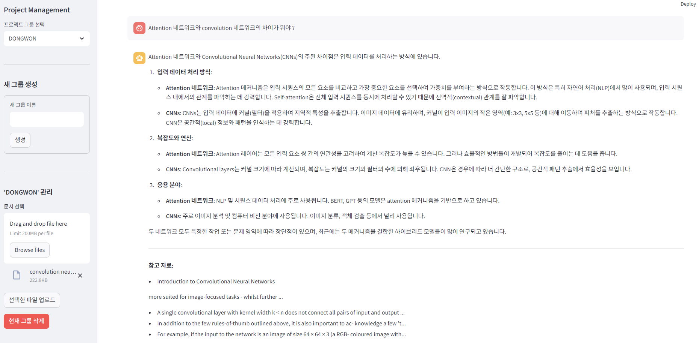
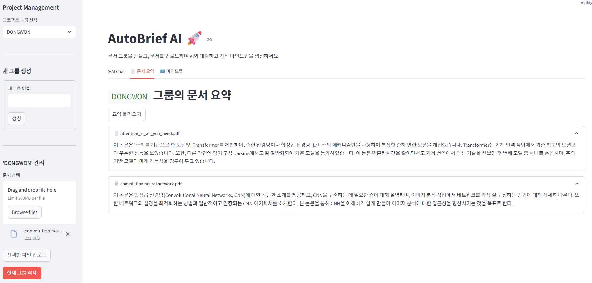
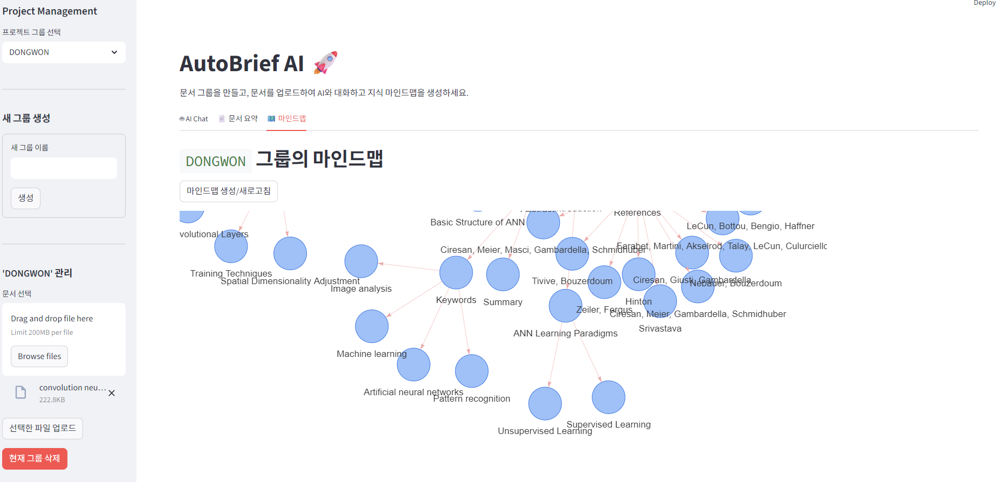

<div align="center">
  <h1>AutoBrief AI 🚀</h1>
  <p><strong>AI 기반 자동 요약 및 지식 시각화 솔루션</strong></p>
  <p>
    
    
    
    
    
  </p>
</div>

---

**AutoBrief**는 사용자가 업로드한 문서 그룹을 기반으로 스스로 학습하고 성장하는 지능형 지식 관리 시스템입니다. RAG(Retrieval-Augmented Generation) 기술을 통해 자신의 문서와 깊이 있는 대화를 나누고, 자동 생성된 요약과 동적 마인드맵으로 지식의 전체 구조와 흐름을 한눈에 파악하세요.

## ✨ 주요 기능 (Key Features)

| 기능 | 설명 |
| :--- | :--- |
| 🗂️ **프로젝트 그룹 관리** | 주제나 프로젝트별로 문서를 그룹화하여 체계적으로 관리합니다. |
| 📄 **다양한 문서 지원** | PDF, DOCX, PPTX 등 다양한 포맷의 문서를 손쉽게 업로드하고 처리합니다. |
| 💬 **AI 채팅 (RAG)** | 문서 내용을 기반으로 AI와 대화하고, 답변의 근거가 된 원문까지 확인합니다. |
| ✍️ **문서 자동 요약** | 긴 문서의 핵심 내용을 AI가 간결하게 요약하여 시간을 절약해 줍니다. |
| 🗺️ **동적 마인드맵** | 문서들의 핵심 주제와 관계를 분석하여 인터랙티브한 마인드맵으로 시각화합니다. |

## 📸 스크린샷 (Screenshots)

<div align="center">
  
  
  
</div>

## 🏗️ 시스템 아키텍처 (System Architecture)

본 프로젝트는 Docker Compose를 통해 관리되는 **마이크로서비스 아키텍처(MSA)**로 설계되어, 각 컴포넌트의 독립성과 확장성을 보장합니다.

- **Frontend**: `Streamlit`으로 구현된 사용자 인터페이스
- **Backend**: `FastAPI`로 구현된 고성능 API 서버
- **Worker**: `RabbitMQ`로부터 작업을 받아 문서 처리(임베딩, 요약 등)를 수행하는 백그라운드 프로세스
- **Database**: `PostgreSQL`을 사용하여 메타데이터, 요약, 마인드맵 등을 영구 저장
- **Message Queue**: `RabbitMQ`를 사용하여 API와 Worker 간의 안정적인 비동기 통신을 중재
- **Vector Store**: `Qdrant`를 사용하여 문서 임베딩 벡터를 저장하고 빠른 유사도 검색을 수행

## 🛠️ 기술 스택 (Tech Stack)

- **Backend**: Python, FastAPI, LangChain, OpenAI, Pika (for RabbitMQ), Psycopg2
- **Frontend**: Streamlit, Streamlit-Agraph, Requests
- **Infrastructure**: Docker, Docker Compose, PostgreSQL, RabbitMQ, Qdrant

## 🚀 시작하기 (Getting Started)

### 사전 준비 (Prerequisites)

- [Docker](https://www.docker.com/get-started) & [Docker Compose](https://docs.docker.com/compose/install/)
- OpenAI API Key

### 설치 및 실행 (Installation & Run)

1.  **프로젝트 클론 (Clone the repository)**
    ```bash
    git clone [https://github.com/your-username/autobrief.git](https://github.com/your-username/autobrief.git)
    cd autobrief
    ```

2.  **.env 파일 생성 (Create .env file)**
    프로젝트 루트에 `.env` 파일을 생성하고 API 키를 입력하세요.
    ```env
    # .env
    OPENAI_API_KEY="sk-..."
    ```

3.  **Docker Compose 실행 (Run with Docker Compose)**
    모든 서비스를 빌드하고 시작합니다.
    ```bash
    docker-compose up --build -d
    ```

4.  **애플리케이션 접속 (Access the application)**
    - **🌐 Frontend (Streamlit)**: `http://localhost:8501`
    - **⚙️ Backend API Docs (FastAPI)**: `http://localhost:8000/docs`

## 📁 프로젝트 구조 (Project Structure)
├── core/                # FastAPI 백엔드 및 Worker 소스코드
│   ├── api/             # API 엔드포인트 정의
│   ├── app/             # FastAPI 앱, Worker 진입점
│   ├── crud/            # 데이터베이스 CRUD 로직
│   └── ...
├── asset/               # README용 이미지 에셋
├── streamlit/           # Streamlit 프론트엔드 소스코드
│   └── app.py
├── .env                 # 환경 변수 파일
├── docker-compose.yaml  # 서비스 오케스트레이션 설정
└── README.md            # 바로 이 파일